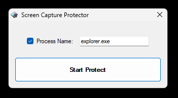

# Screen Capture Protector 

Microsoft has developed an API named [**SetWindowDisplayAffinity**](https://learn.microsoft.com/en-us/windows/win32/api/winuser/nf-winuser-setwindowdisplayaffinity?redirectedfrom=MSDN) to support window content protection. This feature enables applications to protect application content from being captured or copied through a specific set of public operating system features and APIs.

Unlike other security features or an implementation of DRM, there is no guarantee that this API can strictly protect window content, for example, where someone takes a photograph of the screen using a mobile camera. But this API is feasible and easy to use.

## Usage/Examples

There are two types of DWORD values **WDA_MONITOR** and **WDA_NONE**. We have to set **WDA_MONITOR** to protect the application contents.

```cs
public class ProtectorHelper : IProtectorHelper
{
    private const uint WDA_NONE = 0x00000000;
    private const uint WDA_MONITOR = 0x00000001;

    [DllImport("user32.dll")]
    public static extern uint SetWindowDisplayAffinity(IntPtr hWnd, uint dwAffinity);

    public bool Start(Form form)
    {
        if (form == null)
            throw new ArgumentNullException(nameof(form));

        try
        {
            SetWindowDisplayAffinity(form.Handle, WDA_MONITOR);
            return true;
        }
        catch
        {
            return false;
        }
    }

    public bool StartWithProcess(Form form, string processName)
    {
        if (form == null)
            throw new ArgumentNullException(nameof(form));
        if (processName == null)
            throw new ArgumentNullException(nameof(processName));

        try
        {
            var processes = Process.GetProcessesByName(processName);

            if (processes != null)
                SetWindowDisplayAffinity(form.Handle, WDA_MONITOR);

            return true;
        }
        catch
        {
            return false;
        }
    }

    public bool Stop(Form form)
    {
        try
        {
            SetWindowDisplayAffinity(form.Handle, WDA_NONE);
            return true;
        }
        catch
        {
            return false;
        }
    }
}
```

## Screenshots
*Protect with Process Name*



*Protected*


*Protect without Process Name*


## Issues, Feature Requests or Support
Please use the [New Issue](https://github.com/akinbicer/screen-capture-protector/issues/new) button to submit issues, feature requests, or support issues directly to me. You can also send an e-mail to akin.bicer@outlook.com.tr.
